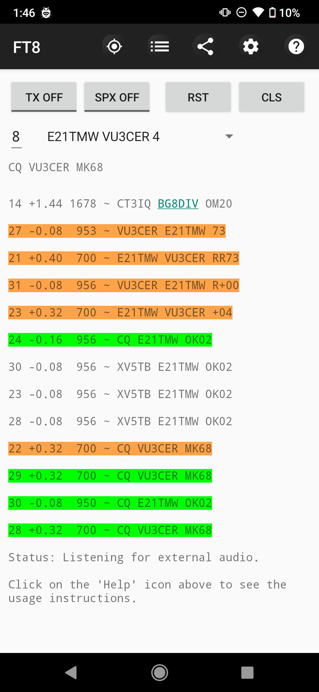
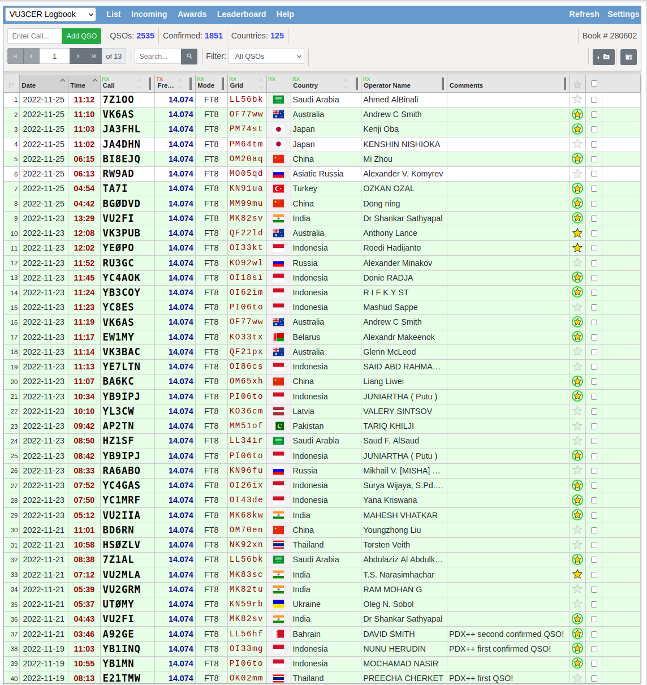
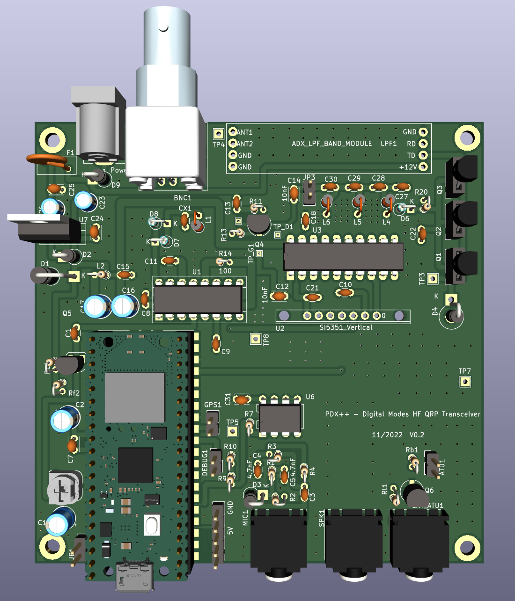

#### PDX++ (PDX Plus Plus)

A port of https://github.com/WB2CBA/ADX/ to Raspberry Pi Pico with a couple of
enhancements.

PDX++ uses CD2003 (an AM receiver chip) for RX. For TX, we rely on the
AFSK-driving-Si5351 technique. PDX++ uses the common 3 x BS170 Class-E
amplifier design.

Bands covered: 80-meter to 10-meter.

Note: This repository contains the complete source-code for PDX++ (including
KiCad design files).

Update (17-November-2021): PCB V0.01 was sucessfully validated and is on air!

First QSO from PDX++:

QSOs from PDX++:

Note: This project was built using the following:

- KiCad 6.0.x

- https://github.com/earlephilhower/arduino-pico (v2.6.3)

Cost to build: < 1600 INR (around ~20 USD). Including all connectors + LPF.

RX power consumption is 45mA @ 12.0 volts (around 0.56 watt).

#### Schematic

See [the PDX++ schematic](./PDX++.pdf).

#### Build Tips

For the `PCB V0.01` board, build and test the TX section first.

#### Features

- Easy inbuilt and self-sufficient Si5351 calibration

- Inbuilt BCI (broadcast interference) filter

- New AFSK circuit using a LM393 comparator

- Full CAT support (which avoids VOX mode which can trigger false TX under many
  conditions)

- [Optional] Native FT8 decoding on the Pico (via AA1GD)

  - Use https://github.com/kholia/pico_ft8_xcvr firmware

- [Optional] Native spotting (reporting to PSKReporter.info) when using Pico W

  - https://github.com/kholia/SunshineFT8/

#### BOM Sources

International users can buy from Mouser and DigiKey.

Here are some local BOM sources I use:

- https://inkocean.in/ - CD2003 (Chinese clone which is known to work fine)

- https://rarecomponents.com/store/1002 - NXP 1N4148

- https://projectpoint.in/ - CDIL 7805, PJ307 Stereo Socket, winding wire, high quality passives

- https://www.evelta.com/l7805-positive-voltage-regulator-1-5a-5v/ (alternate)

- https://robu.in/product/si5351a-i2c-8-khz-160-mhz-clock-generator-breakout-board-module/

- https://robu.in/product/raspberry-pi-pico/

- https://www.semikart.com/ - has everything we need and more

#### Credits

- https://github.com/WB2CBA/ADX/

- https://github.com/lu7did/ADX-rp2040

- https://github.com/lu7did (ZCD code, freqPIO code)

- https://github.com/aa1gd/pico_ft8_xcvr (AA1GD, for native FT8 decoding)

- https://www.qrz.com/DB/VU2BGS (layout and general help)

#### References

- https://f5npv.wordpress.com/homebrew-ft8qrp-afp-fsk-trx/
